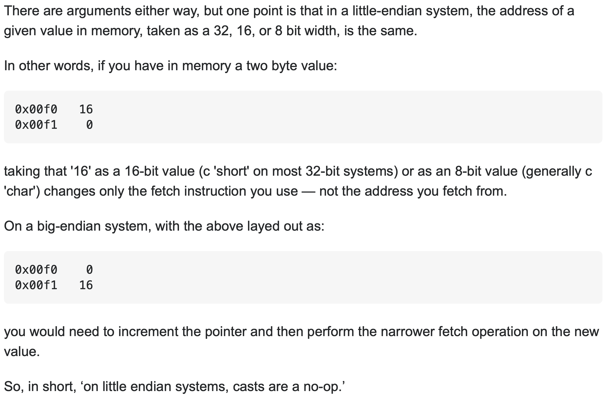

1. **请简述 80x86 系列的发展历史**

   1. 8086：16 位处理器，数据总线 16 位，地址总线 20 位，能寻址 1MB
   2. 80286：16 位处理器，数据总线 16 位，地址总线 24 位，能寻址 16MB
   3.  80386：IA-32 架构，32 位处理器，数据总线和地址总线都是 32 位，能寻址 4GB ，兼容 16 位处理器，增加了保护模式、优先级、任务切换和片内的存储单元管理等硬件单元，采用了外置高速缓存
   4. 80486：集成了浮点处理器和 8KB 的一级缓存，使用了流水线技术、倍频技术
   5. 80586：奔腾，采用了超标量体系机构
   6. 奔腾 Pro ：P6 架构，有一个 256KB 的二级缓存芯片，采用了动态执行技术、超流水线技术，使用乱序执行和分支预测技术
   7. 奔腾二：运动多媒体扩展技术，增加了专用语多媒体处理的指令和专用寄存器
   8. 奔腾三：新增了 SEE 指令集用于单精度浮点多媒体计算
   9. 奔腾四：新增了 SEE2 指令集用于双精度浮点多媒体算

2. **说明小端和大端的区别，并说明 80x86 系列采用了哪种方式?**

   小端是把数字的低位放在内存的低地址，大端是把数字的高位放在内存的低地址

   80x86 采用的是小端，因为采用了复杂指令集

   [Why is x86 little endian?](https://stackoverflow.com/questions/5185551/why-is-x86-little-endian)

   [What is the advantage of little endian format?](https://softwareengineering.stackexchange.com/questions/95556/what-is-the-advantage-of-little-endian-format)

   

3. **8086 有哪五类寄存器，请分别举例说明其作用?**

   数据寄存器：AX、BX、CX、DX，放通用数据

   指针寄存器：SP 堆栈指针，与 SS 配合使用，指向目前的堆栈位置；BP 基数指针，用作 SS 的一个相对基址位置

   变址寄存器：SI 源变址寄存器，存放相对于 DS 段的源变址指针；DI 目的变址寄存器，存放相对于 ES 段的目的变址指针

   控制寄存器：IP 指令指针，存放段内地址偏移量；FLAG 状态标志，存放 CPU 的状态

   段寄存器：CS 代码段寄存器，存放代码指令地址；DS 数据段寄存器，存放数据内存地址；SS 堆栈段寄存器，存放堆栈地址；ES 附加段寄存器，存放附加段地址

4. **什么是寻址?立即寻址和直接寻址的区别是什么?**

   寻址是找到操作数的地址，从而能够取出操作数

   立即寻址是直接给出操作数，事实上没有寻址；直接寻址是给出地址来取操作数

5. **请举例说明寄存器间接寻址、寄存器相对寻址、基址加变址寻址、相对基址加变址寻址四种方式的区别**

   寄存器间接寻址：操作数有效地址在寄存器里，MOV AX [BX]

   寄存器相对寻址：操作数有效地址是寄存器里值加上偏移量，MOV AX [SI+3]

   基址加变址寻址：把一个基址寄存器的内容加上变址寄存器的内容，并以一个段寄存器作为地址基准，MOV AX [BX+DI]

   相对基址加变址寻址：在基址加变址寻址的基础上加偏移量，MOV AX [BX+DI+3]

6. **请分别简述 MOV 指令和 LEA 指令的用法和作用?**

   MOV 对于变量来说加不加中括号都一样都是取值，对于寄存器来说加中括号是取地址中的值，不加中括号是取值

   LEA 对于变量来说加不加中括号都一样都是取地址，对于寄存器来说加中括号是取值，不加中括号非法

7. **请说出主程序与子程序之间至少三种参数传递方式**

   利用寄存器传参、利用约定地址传参、利用堆栈传参（常用）

8. **如何处理输入和输出，代码中哪里体现出来?**

   作为字符串一整行输入所有内容，逐个字符判断是否是负号或者空白符号，将空白符号之间的字符串取出来转换成数字逆序存储，用两个变量分别存符号和长度

   根据符号和长度变量，把内存里的数字加上符号 0 再逆序输出

9. **有哪些段寄存器**

   代码段、数据段、堆栈段、附加段

10. **通过什么寄存器保存前一次的运算结果，在代码中哪里体现出来。**

    eax 保存乘除法的结果，edx 保存除法的余数

11. **解释 boot.asm 文件中，org 07c00h 的作用**

    告诉汇编器这段代码会放在 07c00h 位置，之后遇到绝对寻址的指令，那么绝对地址就是这个地址加上相对地址，相对地址被汇编后正好与绝对地址吻合

12. **boot.bin 应该放在软盘的哪一个扇区?为什么?**

    第一个，BIOS 程序检查软盘的 0 面 0 磁道 1 扇区，如果扇区以 0xaa55 结束则认定为引导扇区

13. **loader 的作用有哪些?**

    跳入保护模式、启动内存分页、读取内核放入内存跳转运行内核

14. **解释 NASM 语言中 [ ] 的作用**

    解引用

15. **解释语句 times 510-(\$-\$\$) db 0，为什么是 510? \$ 和 \$\$ 分别表示什么?**

    用 0 填充程序到 510 个字节为止，最后的结束标志占 2 个字节，\$ 表示当前指令的地址，$\$ 表示程序的起始地址，\$-\$\$ 就是本条指令之前的字节数

16. **解释配置文件 bochsrc 文件中各参数的含义 **

    megs:32

    虚拟机内存 32 MB

    display_library: sdl

    使用 sdl 作为 GUI 库

    floppya: 1_44=a.img, status=inserted

    使用 a.img 作为虚拟机外设软盘，并且是插入状态

    boot: floppy

    虚拟机启动方式，从软盘启动
